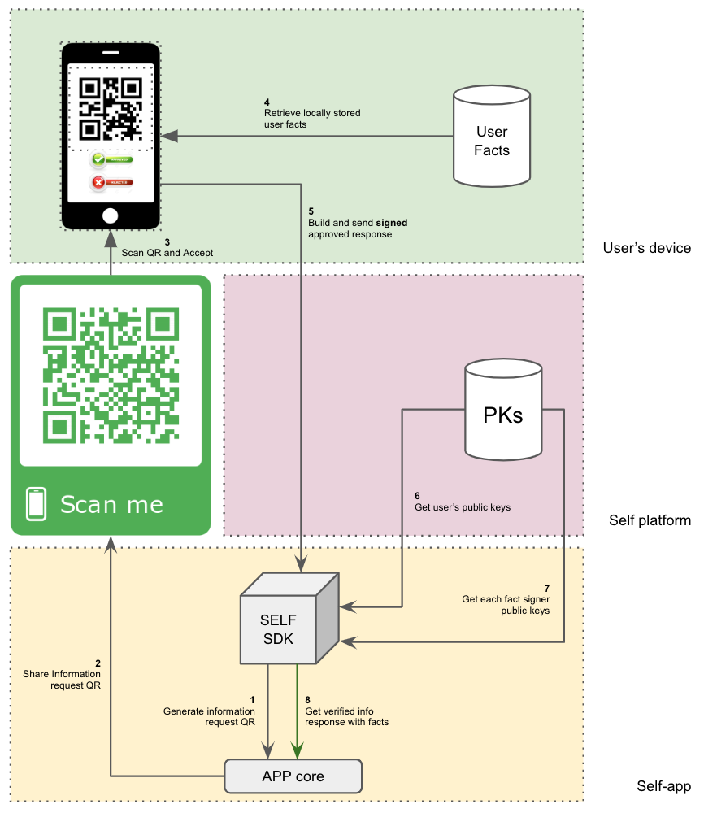

# QR based information request

Your app can request certain bits of information to your connected users via QR code. To do this, you'll only need its _SelfID_ and the fields you want to request you can find a list of updated valid fields [here](https://github.com/selfid-net/selfid-gem/blob/master/lib/sources.rb).

As part of this process, you have to share the generated QR code with your users, and wait for a response

## Running this example

In order to run this example, you must have a valid app keypair. Self-keypairs are issued by [Self Developer portal](https://developer.selfid.net/) when you create a new app.

Once you have your valid `SELF_APP_ID` and `SELF_APP_SECRET` you can run this example with:

```bash
$ SELF_APP_ID=XXXXX SELF_APP_SECRET=XXXXXXXX ruby app.rb <user_self_id>
```

## Process diagram

This diagram shows how does an authentication process wrk internally.




1. Generate Self information request QR code
2. Share generated QR code with your user
3. The user scans the Self information request QR code
4. The user will select the requested facts and accept sharing them with you.
5. The user’s device will send back a signed response with specific facts
6. Self SDK verifies the response has been signed by the user based on its public keys.
7. Self SDK verifies each fact is signed by the user / app specified on each fact.
8. Your app gets a verified response with a list of requested verified facts.

